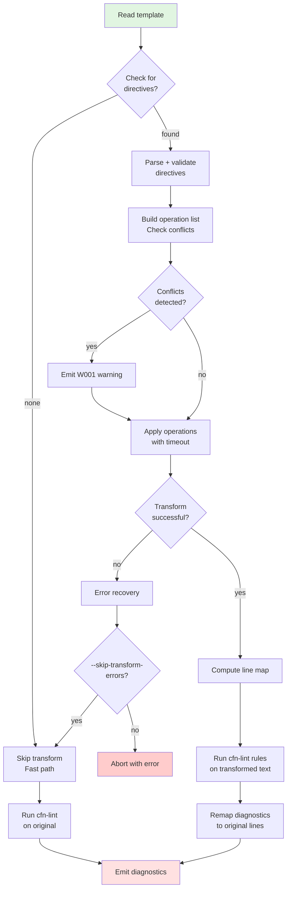

# cfn-lint Transformer Enhancement — Design Specification Prompt

## Persona
You are **Roo Code** in **Architect mode**.  

## Objective

> **Note:** The transformation engine is **disabled by default** and is activated exclusively when the `--transform` command line parameter is specified.

Produce a **precise, implementation-ready** (markdown formatted) design spec for a `cfn-lint` extensible preprocessing transformer framework, that rewrites CloudFormation **YAML** templates **in-memory before linting**. `find_replace` is the **first** transformer command — more commands will follow.

## Outcomes
A complete design doc including:
- Architecture
- Directive grammar (formal EBNF + command-specific grammars)
- Parser & transformation algorithms
- Line-mapping strategy and reference implementation
- Error model (deterministic codes)
- Performance & caching
- Extensibility (command registry, versioning)
- Unit/integration/fuzz test plan (use existing cfn-lint test framework)
- VS Code integration notes (preview/toggle)
- Mermaid pipeline diagram
- Worked examples (consistent format)

## Scope & Constraints
- ✅ YAML templates only (this iteration).
- ✅ Directives are comment lines beginning with `# cfn-lint:`.
- ❌ No on-disk template modifications by the transformer.
- Transformer must:
  1. Operate on an in-memory copy.
  2. Maintain transformed → original line mapping for diagnostics.
  3. Implement the first command `find_replace` with `file` / `line` scope.
  4. Validate directive syntax strictly and emit helpful errors.

## Directive Syntax

### Direct line format

```
# cfn-lint:[@<version>] <command> <scope> <parameters>
```

- `<command>` is a token identifying the transformer (e.g., `find_replace`).
- `<scope>` = `file` | `line`.
- `<parameters>` raw string until newline (whitespace preserved), and is command-specific (see below).

> Note: `find_replace` is the first shipped command; framework must treat commands generically so new transformers can be added without grammar changes.

### Continuation lines

```
# cfn-lint+ <additional parameters or content>
```

- Must directly follow a directive line or another continuation line.
- Concatenated to form a single logical directive’s parameter block, separated by a single space.


## Regex Engine Limitation & Timeouts
- **MUST** use Python stdlib: `import re` only.
- No external regex engines.

## Performance Targets
- **Transformation completion**: < 1000ms for 1000-line template (excluding I/O) on Intel i7 CPU architecture
- **Memory overhead**: < 2x original template size during transformation
- **Regex cache**: Maximum 100 compiled patterns (LRU eviction)
- **Line mapping computation**: O(n) where n = number of lines

## Formal Grammar (EBNF) — core directive

```ebnf
directive_line   = "#" , " " , "cfn-lint" , version_opt , ":" , " " , command , " " , scope , " " , params ;
continuation_line= "#" , " " , "cfn-lint+" , " " , continuation_text ;

version_opt      = [ "@" , version ] ;
version          = digit , { digit | "." } ;
command          = letter , { letter | digit | "_" } ;
scope            = "line" | "file" | "template" ;
params           = { any_char_except_newline } ;
continuation_text= { any_char_except_newline } ;
```

### find_replace — command-specific param grammar (EBNF)

```ebnf
find_replace_params = "regex:" , " " , pattern , " " , "with:" , " " , replacement , flags_opt ;
flags_opt           = "" | " " , "flags:" , " " , flag_list ;
flag_list           = flag , { "," , flag } ;
flag                = "IGNORECASE" | "MULTILINE" | "DOTALL" | "ASCII" | "VERBOSE" ;
pattern             = quoted | unquoted ;
replacement         = quoted | unquoted ;
quoted              = "'" , qchars , "'" | '"' , qchars , '"' ;
qchars              = { any char with escapes } ;
unquoted            = { non-space chars } ;
```

## Parsing & Transformation Algorithm (high-level)

1. Scan file line-by-line.
2. Identify:
  * Directive line: matches directive_line regex.
  * Continuation line: matches continuation_line regex.
3. For each directive:
  * Merge all following continuation lines into a single parameter string, separating each merge with one space.
4. Store:
  * Original line number of directive start.
  * Final merged directive string


1. **Single scan**: read template text line-by-line; collect directive lines and continuation lines (`# cfn-lint+ `).
2. **Identify directives**: identify directive lines (matches directive_line regex) and continuation lines (matches continuation_line regex).
3. **Compile directives**: merge all following continuation lines into a single parameter string, separating each merge with one space.
2. **Parse/validate**: parse directive tokens using the grammar; validate command, scope, params.
3. **Build operation list**: ordered by appearance.
4. **Apply transforms**:
   * `scope=line`: apply transformation only to the immediate next non-directive line (strictly the first following non-directive YAML line).
   * `scope=file`: apply transformation to full template text.
   * Never alter directive or continuation lines.
5. **Line mapping**: after transforms, compute a mapping `transformed_line -> original_line` for diagnostics (use `build_line_map`).
6. **Lint**: run cfn-lint rules over transformed text.
7. **Report**: remap diagnostics to original line numbers using the mapping.

## Edge Case Handling

### Multi-line YAML Values
- Directives embedded within multi-line YAML strings (literal `|` or folded `>` style) are **not** processed as directives
- Only comments at column 0 or after proper YAML indentation are considered directive candidates

### Directive Conflicts
- When multiple `line` scope directives target the same line: **last directive wins**
- When `file` and `line` scope directives conflict: apply in order of appearance
- Emit warning `W001` for detected conflicts with `--verbose` flag

### Unicode & Encoding
- All patterns and replacements must be valid UTF-8
- Use Python's `errors='replace'` strategy for malformed UTF-8 sequences
- Byte Order Mark (BOM) is preserved if present in original template
- Preserve line endings (LF/CRLF).

### Error Recovery Strategy
- **Partial transformation failures**: 
  - For `line` scope: skip the failed transformation, log error, continue with next
  - For `file` scope: abort all transformations, return original template with error
- **Rollback**: Maintain original template copy until all transformations succeed
- **Graceful degradation**: Add `--skip-transform-errors` CLI flag to continue linting on original template when transformations fail

## Line-mapping — reference implementations & notes

* Provide a `build_line_map(original_text, transformed_text)` that returns an array/list mapping transformed 1-based line numbers → original 1-based line numbers.
* Provide a small offset→line helper for any byte-offset cases.

### Preferred mapping (SequenceMatcher approach)

```python
import difflib
from typing import List, Optional

def build_line_map(original_text: str, transformed_text: str) -> List[int]:
    """
    Map transformed line numbers (1-based) to original line numbers (1-based).
    
    Handles edge cases:
    - Empty files return [0]
    - Single-line files handled correctly
    - Preserves monotonic property: line_map[i] <= line_map[i+1]
    """
    # Edge case: empty transformed text
    if not transformed_text:
        return [0]
    
    # Edge case: empty original text (shouldn't happen, but be defensive)
    if not original_text:
        new_line_count = len(transformed_text.splitlines())
        return [0] * (new_line_count + 1)
    
    orig_lines = original_text.splitlines(keepends=True)
    new_lines = transformed_text.splitlines(keepends=True)
    
    # Edge case: single-line handling
    if len(orig_lines) == 0:
        orig_lines = [original_text]
    if len(new_lines) == 0:
        new_lines = [transformed_text]
    
    sm = difflib.SequenceMatcher(a=orig_lines, b=new_lines, autojunk=False)
    line_map = [0] * (len(new_lines) + 1)  # 1-based index

    for tag, i1, i2, j1, j2 in sm.get_opcodes():
        if tag == "equal":
            for k in range(i2 - i1):
                line_map[j1 + k + 1] = i1 + k + 1
        elif tag in ("replace", "insert"):
            # Map inserted/changed transformed lines to the nearest original line at or before region.
            prev_orig = i1  # may be 0 if at file start
            for k in range(j2 - j1):
                mapped = prev_orig if prev_orig > 0 else 1
                line_map[j1 + k + 1] = mapped
        elif tag == "delete":
            # no transformed lines to map
            continue

    return line_map
```

### Byte-offset → line helper (small utility)

```python
from typing import Dict

def build_offset_line_map(template_str: str) -> Dict[int, int]:
    """
    Map byte-offset -> line number.  Useful for offset-based diagnostics.
    
    Handles edge cases:
    - Empty string returns {0: 1}
    - Accounts for different newline styles (\n, \r\n, \r)

    NOTE: Currently uses splitlines(True) which normalises on '\n' boundaries.
    NOTE: This newline handling is **hard-coded**; future enhancement: expose newline handling as configuration.
    """
    if not template_str:
        return {0: 1}
    
    line_map = {}
    offset = 0
    for lineno, line in enumerate(template_str.splitlines(True), start=1):
        line_map[offset] = lineno
        offset += len(line)
    
    # Add final offset for EOF
    line_map[offset] = lineno
    return line_map
```

## Command Registry Interface

```python
from abc import ABC, abstractmethod
from typing import Dict, Any, Optional, Tuple
from dataclasses import dataclass

@dataclass
class TransformContext:
    """Context passed to transformer handlers"""
    original_text: str
    current_text: str
    directive_line: int
    warnings: List[str]
    
class TransformerHandler(ABC):
    """Base class for all transformer command handlers"""
    
    @abstractmethod
    def parse(self, params: str) -> Dict[str, Any]:
        """
        Parse command-specific parameters.
        
        Args:
            params: Raw parameter string after scope
            
        Returns:
            Parsed parameters dictionary
            
        Raises:
            TransformerError: On invalid parameters (E003)
        """
        pass
    
    @abstractmethod
    def apply(self, scope: str, template_text: str, context: TransformContext) -> Tuple[str, List[str]]:
        """
        Apply transformation to template.
        
        Args:
            scope: 'file' or 'line'
            template_text: Text to transform
            context: Transformation context
            
        Returns:
            Tuple of (transformed_text, warnings_list)
            
        Raises:
            TransformerError: On transformation failure
        """
        pass
    
    @abstractmethod
    def describe(self) -> str:
        """
        Return human-readable description of this transformer.
        
        Returns:
            Description string for help/documentation
        """
        pass
```

## Error Model

* Deterministic error codes / structured messages:

  * `E001` — Unknown command (e.g., "Unknown transformer command: 'find_replacee'. Did you mean 'find_replace'?")
  * `E002` — Unknown scope (e.g., "Invalid scope: 'global'. Must be 'file' or 'line'")
  * `E003` — Missing/invalid parameters (e.g., "Missing required parameter 'regex:' in find_replace")
  * `E004` — Regex compilation error (e.g., "Invalid regex pattern: unmatched parenthesis at position 15")
  * `E005` — Regex execution timeout / catastrophic pattern (e.g., "Regex timeout (1.0s) - pattern may have catastrophic backtracking")
  * `E006` — Unicode decode error (e.g., "Invalid UTF-8 sequence in pattern at byte offset 42")
  * `E007` — Directive conflict (e.g., "Multiple line-scope directives target line 45")
  
* Warning codes:
  * `W001` — Directive conflict detected (non-fatal)
  * `W002` — Pattern matches but produces no change
  * `W003` — Transformation resulted in invalid YAML (linting will likely fail)

* Error format:
  ```
  [ERROR_CODE] at line <line_number>: <message>
  Directive: <full_directive_text>
  Suggestion: <remediation_hint>
  ```

## Performance & Safety

* Skip files with no directives (fast-path check before parsing).
* Compile & cache `(pattern, flags)` → compiled `re.Pattern` with LRU cache (max 100 entries).
* Use single-pass operations where possible; avoid repeated parsing.
* Pre-allocate line mapping arrays based on line count estimates.

## Extensibility

* Implement a **command registry** (map command token → handler class).
* Directives may include optional versioning: `# cfn-lint:@1 ...`.
* Handlers must implement: `parse(params)`, `apply(scope, template_text, context)`, `describe()`.
* Version compatibility matrix maintained in `TRANSFORMER_VERSIONS` dict.

## Tests (MANDATORY: use existing cfn-lint test framework)

* **Test framework**: Use cfn-lint's existing Pytest-based test harness. Add tests inside the repo's existing `test/` hierarchy (unit & integration locations already used by cfn-lint).

  * Do **not** add a new test framework unless a very strong rationale is documented.
  
* **Unit tests** (`test/unit/transformer/`):
  * Parser: valid/invalid directives, quoting, continuations, flags parsing
  * Engine: `file` and `line` scopes; overlapping directives; directives near file start/end
  * Mapping: identity when no changes; monotonic mapping properties; edge cases (empty, single-line)
  * Unicode: UTF-8 with BOM, invalid sequences, emoji in patterns
  
* **Integration tests** (`test/integration/transformer/`):
  * Full-run on sample templates; assert transformed output snapshots and diagnostics remapped to original lines
  * Error recovery scenarios
  * Performance benchmarks (1000-line template < 100ms)
  
* **Fuzz tests** (`test/fuzz/transformer/`):
  * Random patterns under enforced timeouts to detect catastrophic backtracking
  * Random unicode sequences in patterns/replacements
  * Malformed directive syntax permutations

## VS Code Integration Notes

* **Preview Panel**: 
  - Split-view showing original (left) and transformed (right) with diff highlighting
  - Toggle button: "Enable Transformations" per-file with workspace-level default
  - Transformation indicator in status bar when active
  
* **Settings** (`settings.json`):
  ```json
  {
    "cfn-lint.transformer.enabled": true,
    "cfn-lint.transformer.timeout": 1.0,
    "cfn-lint.transformer.showPreview": true,
    "cfn-lint.transformer.warnOnConflicts": true
  }
  ```
  
* **Diagnostics**: 
  - Ensure diagnostics shown in editor map to original source lines
  - Show transformation errors as separate diagnostic category
  - Quick-fix action to disable problematic directive

## Deliverables (PR contents)

* Parser changes + transformer framework + `find_replace` handler.
* Unit & integration tests using cfn-lint's Pytest suite.
* Documentation update (README/dev docs) explaining directive grammar and examples.
* Performance benchmark results showing < 100ms for 1000-line template.
* TODOs: mark hard-coded timeout and newline handling with inline comments and a follow-up RFC to expose them as config.

## Mermaid Diagram



## Examples (consistent format)

### Example 1 — Scope: `line` (find_replace)

* Directive: `# cfn-lint: find_replace line regex: !Sub .*}\/ with: "../../local-"`
* Breakdown:

  | Component | Value           |
  | --------- | --------------- |
  | Command   | `find_replace`  |
  | Scope     | `line`          |
  | regex     | `!Sub .*}\/`    |
  | with      | `"../../local-"` |
  
* **Before**:
  ```yaml
  # cfn-lint: find_replace line regex: !Sub .*}\/ with: "../../local-"
  Image: !Sub ${AWS::AccountId}.dkr.ecr.${AWS::Region}.amazonaws.com/${Repository}:${Tag}/
  AnotherImage: !Sub ${AWS::AccountId}.dkr.ecr.${AWS::Region}.amazonaws.com/${Repo2}:${Tag2}/
  ```
  
* **After**:
  ```yaml
  # cfn-lint: find_replace line regex: !Sub .*}\/ with: "../../local-"
  Image: "../../local-"
  AnotherImage: !Sub ${AWS::AccountId}.dkr.ecr.${AWS::Region}.amazonaws.com/${Repo2}:${Tag2}/
  ```
  
* Transform applies only to the immediate next non-directive line (line 2).

### Example 2 — Scope: `file` (find_replace)

* Directive: `# cfn-lint: find_replace file regex: !Sub .*}\/ with: "../../local-"`
* Applies across the whole template; directive line itself is preserved.

* **Before**:
  ```yaml
  # cfn-lint: find_replace file regex: !Sub .*}\/ with: "../../local-"
  Resources:
    Container1:
      Image: !Sub ${AWS::AccountId}.dkr.ecr.${AWS::Region}.amazonaws.com/${Repository}:${Tag}/
    Container2:
      Image: !Sub ${AWS::AccountId}.dkr.ecr.${AWS::Region}.amazonaws.com/${Repo2}:${Tag2}/
  ```
  
* **After**:
  ```yaml
  # cfn-lint: find_replace file regex: !Sub .*}\/ with: "../../local-"
  Resources:
    Container1:
      Image: "../../local-"
    Container2:
      Image: "../../local-"
  ```

### Example 3 — Complex regex with capture groups and flags

* Directive: `# cfn-lint: find_replace file regex: "arn:aws:s3:::([^/]+)/(.*)" with: "s3://\1/\2" flags: IGNORECASE,MULTILINE`
* Breakdown:

  | Component | Value                           |
  | --------- | ------------------------------- |
  | Command   | `find_replace`                  |
  | Scope     | `file`                          |
  | regex     | `arn:aws:s3:::([^/]+)/(.*)`    |
  | with      | `s3://\1/\2`                    |
  | flags     | `IGNORECASE,MULTILINE`          |

* **Before**:
  ```yaml
  # cfn-lint: find_replace file regex: "arn:aws:s3:::([^/]+)/(.*)" with: "s3://\1/\2" flags: IGNORECASE,MULTILINE
  Resources:
    Policy:
      Resource: arn:aws:s3:::my-bucket/path/to/file.txt
    Role:
      Asset: ARN:AWS:S3:::Another-Bucket/Different/Path
  ```

* **After**:
  ```yaml
  # cfn-lint: find_replace file regex: "arn:aws:s3:::([^/]+)/(.*)" with: "s3://\1/\2" flags: IGNORECASE,MULTILINE
  Resources:
    Policy:
      Resource: s3://my-bucket/path/to/file.txt
    Role:
      Asset: s3://Another-Bucket/Different/Path
  ```

### Example 4 — Error case with diagnostic output

* Directive: `# cfn-lint: find_replace line regex: [unclosed with: "replacement"`
* Error output:
  ```
  [E004] at line 15: Invalid regex pattern: unmatched '[' at position 0
  Directive: # cfn-lint: find_replace line regex: [unclosed with: "replacement"
  Suggestion: Ensure all brackets, parentheses, and special characters are properly escaped or closed.
  ```

## Acceptance Criteria

* Framework supports generic `# cfn-lint: <command> <scope> <parameters>`.
* `find_replace` implemented as first command; handler registered in the command registry.
* Examples produce exact transformed outputs.
* Diagnostics in tests match original line numbers.
* Tests live in cfn-lint's existing Pytest suite.
* Performance benchmarks meet targets (< 100ms for 1000-line template).
* Error recovery and edge cases handled gracefully.
* All error codes documented with examples.

## Open Questions / TODOs

* Expose regex timeout as CLI/VS Code configuration? (Currently **hard-coded at `REGEX_TIMEOUT_SECONDS = 1.0`**; marked with TODO comment)
* New transformer commands — recommend documented contributor guide for adding handlers
* Consider adding `# cfn-lint: disable-transform` directive to skip subsequent transformations
* Future: Support for JSON templates (would require different comment syntax strategy)
