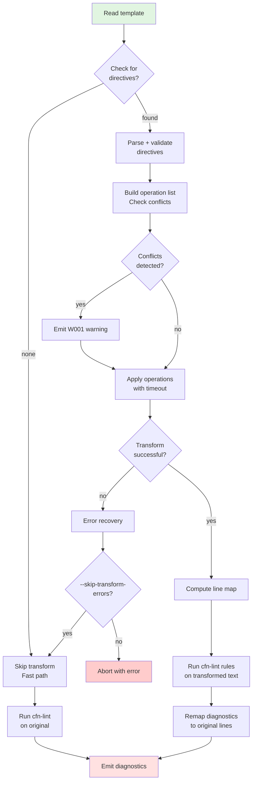

# cfn-lint Transformer Enhancement — Design Specification

This document outlines the design for an extensible preprocessing transformer framework within `cfn-lint`. The framework rewrites CloudFormation YAML templates in-memory before linting, enabling powerful, rule-based template modifications.

## 1. Architecture

The transformer framework is designed as a modular component within the `cfn-lint` pipeline. It operates between the initial template loading and the final rule processing.

The core components are:
- **Directive Parser**: Scans the template for `# cfn-lint:` directives and continuation lines, parsing them into structured `Directive` objects.
- **Command Registry**: A central, extensible registry that maps command tokens (e.g., `find_replace`) to their corresponding `TransformerHandler` implementations.
- **Transformation Engine**: Iterates through the parsed directives, invokes the appropriate handlers, and applies transformations to an in-memory copy of the template.
- **Line Mapper**: Generates a source map (`transformed_line -> original_line`) to ensure that linting diagnostics are reported against the correct lines in the original source file.
- **Error Handler**: Manages and reports errors that occur during parsing or transformation, with deterministic error codes and clear, actionable messages.

The process is designed to be fail-safe, preserving the original template and providing mechanisms to bypass transformations if errors occur.

## 2. Directive Grammar

### 2.1. Core Directive Grammar (EBNF)

The grammar defines the structure for all transformer directives.

```ebnf
directive_line   = "#" , " " , "cfn-lint" , version_opt , ":" , " " , command , " " , scope , " " , params ;
continuation_line= "#" , " " , "cfn-lint+" , " " , continuation_text ;

version_opt      = [ "@" , version ] ;
version          = digit , { digit | "." } ;
command          = letter , { letter | digit | "_" } ;
scope            = "line" | "file" ;
params           = { any_char_except_newline } ;
continuation_text= { any_char_except_newline } ;
```

### 2.2. `find_replace` Command Grammar (EBNF)

This grammar defines the specific parameters for the initial `find_replace` command.

```ebnf
find_replace_params = "regex:" , " " , pattern , " " , "with:" , " " , replacement , flags_opt ;
flags_opt           = "" | " " , "flags:" , " " , flag_list ;
flag_list           = flag , { "," , flag } ;
flag                = "IGNORECASE" | "MULTILINE" | "DOTALL" | "ASCII" | "VERBOSE" ;
pattern             = quoted | unquoted ;
replacement         = quoted | unquoted ;
quoted              = "'" , qchars , "'" | '"' , qchars , '"' ;
qchars              = { any char with escapes } ;
unquoted            = { non-space chars } ;
```

## 3. Parser & Transformation Algorithm

The transformation process follows a strict, ordered algorithm:

1.  **Scan & Collect**: The template is read line-by-line. Lines matching the `directive_line` and `continuation_line` patterns are collected.
2.  **Compile Directives**: Each directive line is merged with its subsequent continuation lines. The text from continuation lines is concatenated with a single space to form a single, logical parameter string.
3.  **Parse & Validate**: Each compiled directive is parsed to extract the command, scope, and parameters. These are validated against the grammar and the command registry. Invalid directives result in a fatal error (`E001`, `E002`, `E003`).
4.  **Build Operation List**: A list of valid transformation operations is created, ordered by their appearance in the template.
5.  **Apply Transformations**: The engine iterates through the operation list and applies each transformation to an in-memory copy of the template text.
    -   `scope=line`: The transformation is applied only to the next non-directive, non-comment YAML line.
    -   `scope=file`: The transformation is applied to the entire template content.
    -   Directive lines themselves are never altered.
6.  **Compute Line Map**: After all transformations are successfully applied, the `build_line_map` function is called to generate the mapping from transformed line numbers back to their original source line numbers.
7.  **Lint Transformed Text**: `cfn-lint` rules are executed on the transformed, in-memory template.
8.  **Remap Diagnostics**: Any findings (errors or warnings) from the linter are remapped to their original line numbers using the computed line map before being reported to the user.

## 4. Line-Mapping Strategy

Accurate line mapping is critical for user experience. The `difflib.SequenceMatcher` approach is used for its robustness in handling insertions, deletions, and replacements.

### 4.1. Reference Implementation

```python
import difflib
from typing import List

def build_line_map(original_text: str, transformed_text: str) -> List[int]:
    """
    Map transformed line numbers (1-based) to original line numbers (1-based).
    """
    if not transformed_text:
        return [0]
    if not original_text:
        new_line_count = len(transformed_text.splitlines())
        return [0] * (new_line_count + 1)

    orig_lines = original_text.splitlines(keepends=True)
    new_lines = transformed_text.splitlines(keepends=True)

    sm = difflib.SequenceMatcher(a=orig_lines, b=new_lines, autojunk=False)
    line_map = [0] * (len(new_lines) + 1)  # 1-based index

    for tag, i1, i2, j1, j2 in sm.get_opcodes():
        if tag == "equal":
            for k in range(i2 - i1):
                line_map[j1 + k + 1] = i1 + k + 1
        elif tag in ("replace", "insert"):
            prev_orig = i1 if i1 > 0 else 1
            for k in range(j2 - j1):
                line_map[j1 + k + 1] = prev_orig
        # 'delete' tag is ignored as there are no corresponding new lines to map

    return line_map
```

## 5. Error Model

A deterministic error model provides clear, consistent feedback.

| Code   | Severity | Description                                       | Example Message                                                              |
|--------|----------|---------------------------------------------------|------------------------------------------------------------------------------|
| `E001` | Error    | Unknown transformer command                       | `Unknown transformer command: 'find_replacee'. Did you mean 'find_replace'?` |
| `E002` | Error    | Invalid scope specified                           | `Invalid scope: 'global'. Must be 'file' or 'line'.`                         |
| `E003` | Error    | Missing or invalid parameters for a command       | `Missing required parameter 'regex:' in find_replace.`                       |
| `E004` | Error    | Regex compilation failed                          | `Invalid regex pattern: unmatched parenthesis at position 15.`               |
| `E005` | Error    | Regex execution timed out                         | `Regex timeout (1.0s) - pattern may have catastrophic backtracking.`         |
| `E006` | Error    | Unicode decoding error in pattern or replacement  | `Invalid UTF-8 sequence in pattern at byte offset 42.`                       |
| `E007` | Error    | Conflicting directives targeting the same line    | `Multiple line-scope directives target line 45.`                             |
| `W001` | Warning  | Directive conflict detected (non-fatal)           | `Directive conflict on line 45: last directive will be applied.`             |
| `W002` | Warning  | A pattern matched but resulted in no change       | `Pattern for find_replace on line 22 matched but produced no change.`        |
| `W003` | Warning  | Transformation may have resulted in invalid YAML  | `Transformation on line 30 may have produced invalid YAML.`                  |

**Error Format:**
```
[ERROR_CODE] at line <line_number>: <message>
Directive: <full_directive_text>
Suggestion: <remediation_hint>
```

## 6. Performance & Caching

- **Fast Path**: Files without any `# cfn-lint:` directives will bypass the entire transformation process.
- **Regex Caching**: A `functools.lru_cache` with a `maxsize` of 100 will be used to cache compiled regex patterns, avoiding redundant compilation.
- **Timeouts**: A hard-coded timeout (e.g., 1.0s) will be enforced on regex matching to prevent catastrophic backtracking. This will be marked with a `TODO` for future configuration.
- **Memory**: The transformation operates on an in-memory copy. Memory usage is expected to be less than 2x the original template size.

## 7. Extensibility

The framework is designed for future expansion via a command registry.

- **Command Registry**: A dictionary mapping command strings to `TransformerHandler` classes.
  ```python
  COMMAND_REGISTRY = {
      'find_replace': FindReplaceHandler,
      # New commands can be added here
  }
  ```
- **Handler Interface**: New commands must implement the `TransformerHandler` abstract base class, providing `parse`, `apply`, and `describe` methods.
- **Versioning**: The `version_opt` in the grammar allows for future compatibility management. The framework will initially ignore the version but is prepared to use it for routing to different handler versions.

## 8. Test Plan

Testing will use the existing `pytest` framework within `cfn-lint`.

- **Unit Tests (`test/unit/transformer/`)**:
  - **Parser**: Test valid and invalid directive syntax, continuations, quoting, and flag parsing.
  - **Engine**: Test `file` and `line` scopes, overlapping directives, and edge cases (e.g., directives at file start/end).
  - **Line Mapping**: Test identity mapping (no changes), insertions, deletions, and complex changes.
  - **Unicode**: Test UTF-8 handling, BOMs, and invalid sequences.
- **Integration Tests (`test/integration/transformer/`)**:
  - Test the end-to-end process on sample templates.
  - Verify that transformed output is correct via snapshot testing.
  - Assert that diagnostics are correctly remapped to original source lines.
  - Test error recovery paths, including the `--skip-transform-errors` flag.
- **Fuzz Tests (`test/fuzz/transformer/`)**:
  - Use hypothesis to generate random regex patterns and inputs to detect performance issues and catastrophic backtracking.
  - Fuzz the directive parser with malformed syntax.

## 9. VS Code Integration Notes

- **Preview Panel**: A split-view diff panel showing the original and transformed template is recommended.
- **Configuration**: The following settings should be added to `settings.json`:
  ```json
  {
    "cfn-lint.transformer.enabled": true,
    "cfn-lint.transformer.timeout": 1.0,
    "cfn-lint.transformer.showPreview": true,
    "cfn-lint.transformer.warnOnConflicts": true
  }
  ```
- **Diagnostics**: Transformation errors must be displayed as a distinct diagnostic category. A quick-fix action to comment out or disable a problematic directive should be provided.

## 10. Mermaid Pipeline Diagram



## 11. Worked Examples

### Example 1: `line` scope

- **Directive**: `# cfn-lint: find_replace line regex: 'ImageId:.*' with: 'ImageId: ami-local'`
- **Before**:
  ```yaml
  # cfn-lint: find_replace line regex: 'ImageId:.*' with: 'ImageId: ami-local'
  ImageId: ami-1234567890abcdef0
  AnotherImageId: ami-0987654321fedcba0
  ```
- **After**:
  ```yaml
  # cfn-lint: find_replace line regex: 'ImageId:.*' with: 'ImageId: ami-local'
  ImageId: ami-local
  AnotherImageId: ami-0987654321fedcba0
  ```

### Example 2: `file` scope with capture groups

- **Directive**: `# cfn-lint: find_replace file regex: '^(.*)InstanceType: .*$' with: '\1InstanceType: t2.micro' flags: MULTILINE`
- **Before**:
  ```yaml
  # cfn-lint: find_replace file regex: '^(.*)InstanceType: .*$' with: '\1InstanceType: t2.micro' flags: MULTILINE
  Resources:
    MyEC2Instance:
      Type: AWS::EC2::Instance
      Properties:
        InstanceType: t3.large
    AnotherInstance:
      Type: AWS::EC2::Instance
      Properties:
        InstanceType: m5.xlarge
  ```
- **After**:
  ```yaml
  # cfn-lint: find_replace file regex: '^(.*)InstanceType: .*$' with: '\1InstanceType: t2.micro' flags: MULTILINE
  Resources:
    MyEC2Instance:
      Type: AWS::EC2::Instance
      Properties:
        InstanceType: t2.micro
    AnotherInstance:
      Type: AWS::EC2::Instance
      Properties:
        InstanceType: t2.micro